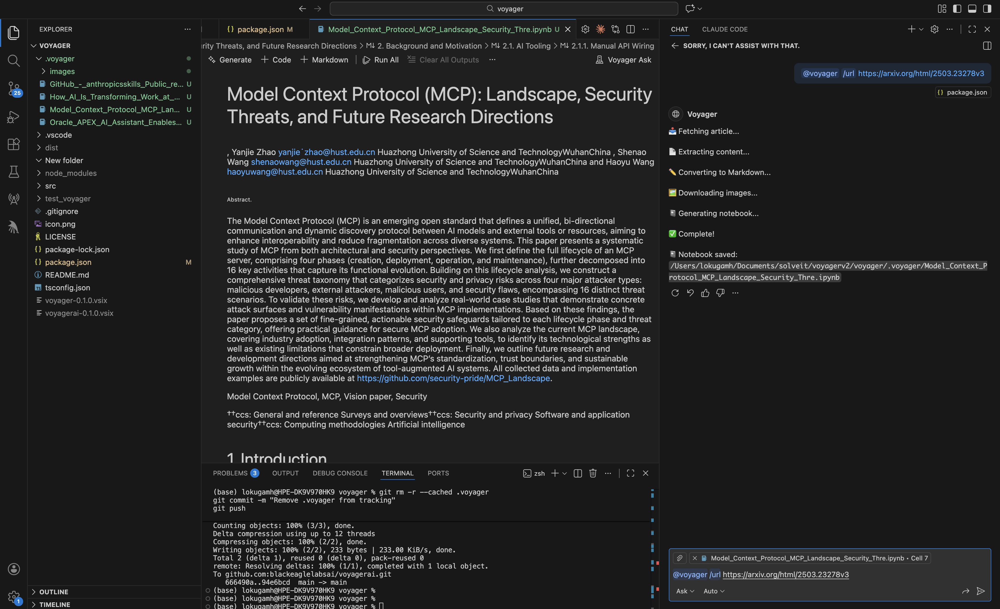
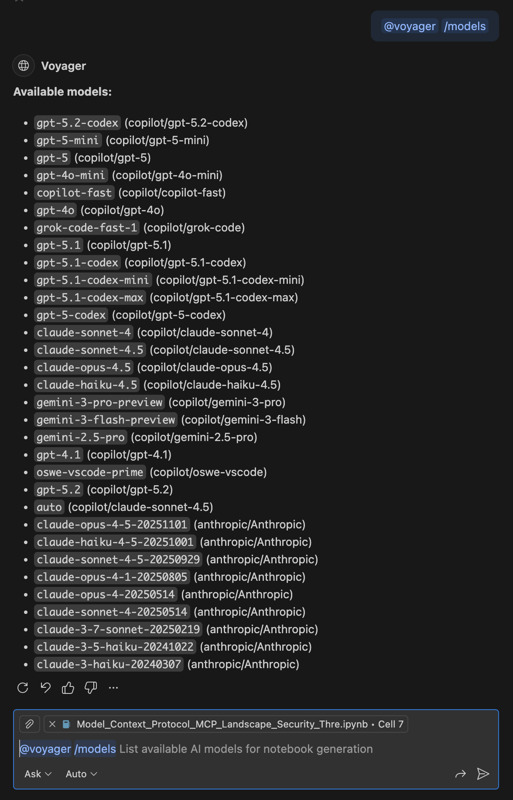
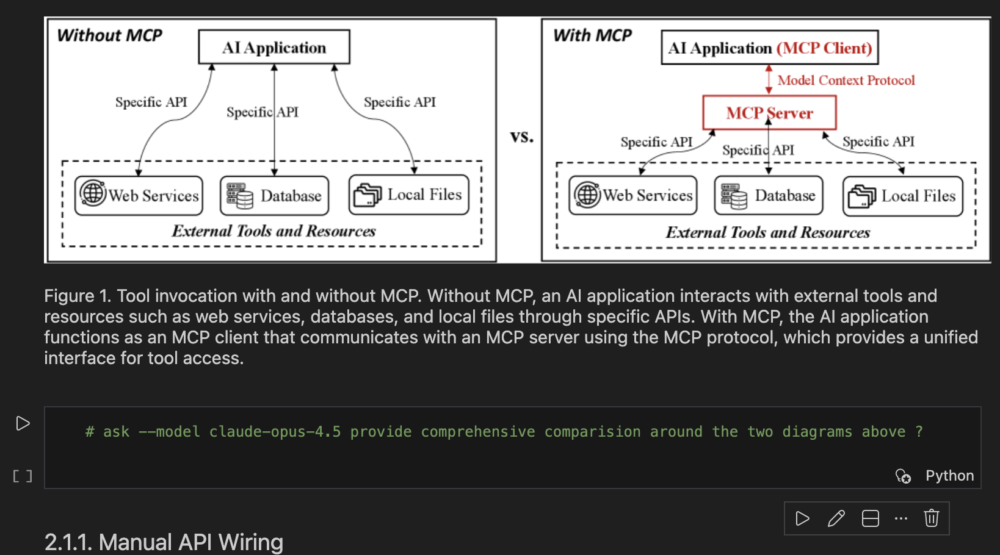
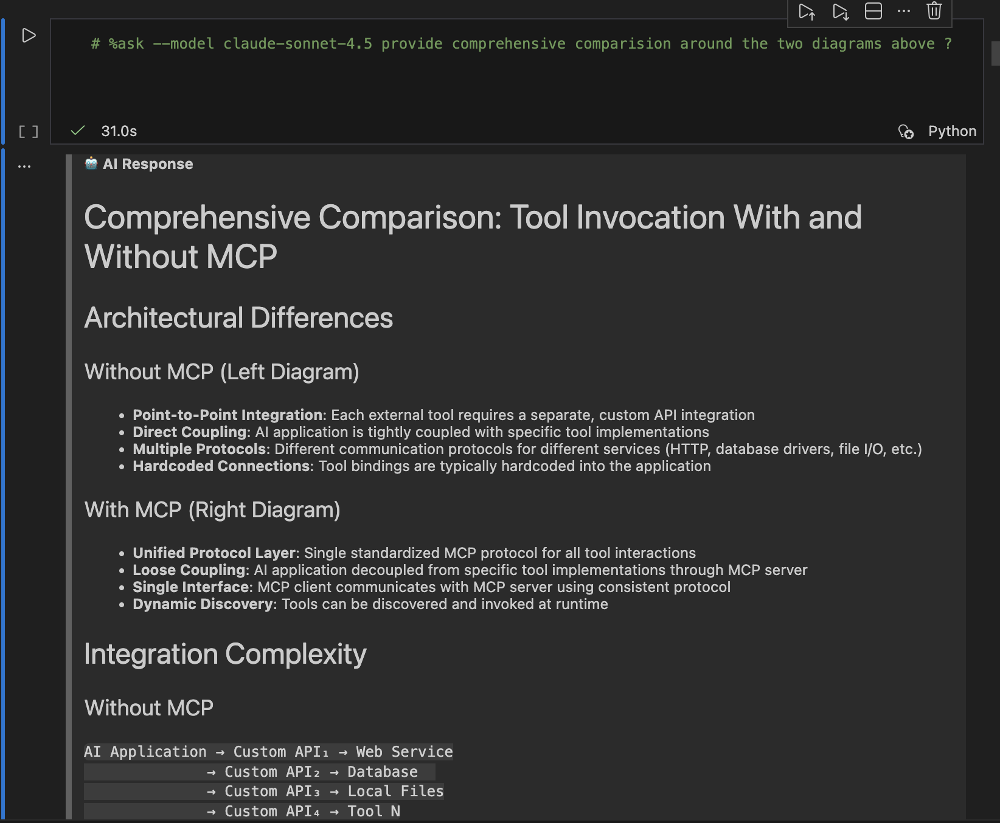

# Voyager AI

**Transform technical articles into interactive Jupyter notebooks with AI-powered learning.**

## Features

### 📥 Convert Any Article to a Notebook
Paste a URL and Voyager fetches the article, extracts content, downloads images, and generates a Jupyter notebook — all within VS Code.

### 🔄 Choose Your Model
List available models with `@voyager /models` and specify your preferred LLM per question.

### 🤖 Ask Questions with Full Context
Use `# %ask` cells to query AI about the article. The LLM receives all content above the cell as context.

## Installation

1. Open VS Code
2. Go to Extensions (`Cmd+Shift+X` / `Ctrl+Shift+X`)
3. Search for "Voyager AI"
4. Click **Install**

## Requirements

- VS Code 1.108.0 or higher
- [GitHub Copilot](https://marketplace.visualstudio.com/items?itemName=GitHub.copilot) extension (for AI features)
- [Jupyter](https://marketplace.visualstudio.com/items?itemName=ms-toolsai.jupyter) extension

## Usage

### Convert an Article

1. Open Copilot Chat (`Cmd+Shift+I`)
2. Type: `@voyager /url https://example.com/article`
3. Voyager creates and opens the notebook

### Ask Questions

1. In the notebook, add a code cell
2. Type: `# %ask --model gpt-4o What is this article about?`
3. Select **Voyager Ask** as the kernel
4. Run the cell (`Shift+Enter`)

### List Available Models

`@voyager /models`

## Extension Settings

This extension contributes no settings currently.

## Known Issues

- Authentication-required pages (e.g., Confluence behind login) are not supported
- Some JavaScript-rendered pages may not extract content properly

## Release Notes

### 0.1.0

- Initial release
- Article to notebook conversion
- AI-powered `# %ask` cells
- Model selection via `--model` flag

---

## Support

If you find Voyager useful, consider supporting development:

## License

[MIT](LICENSE)

---

**Enjoy learning with Voyager!** 🚀